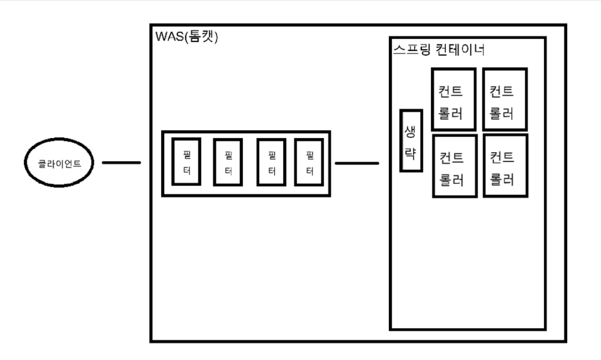
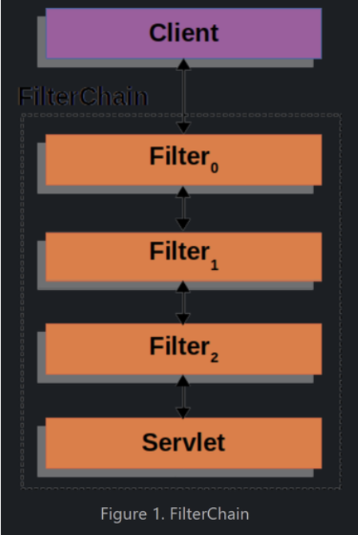
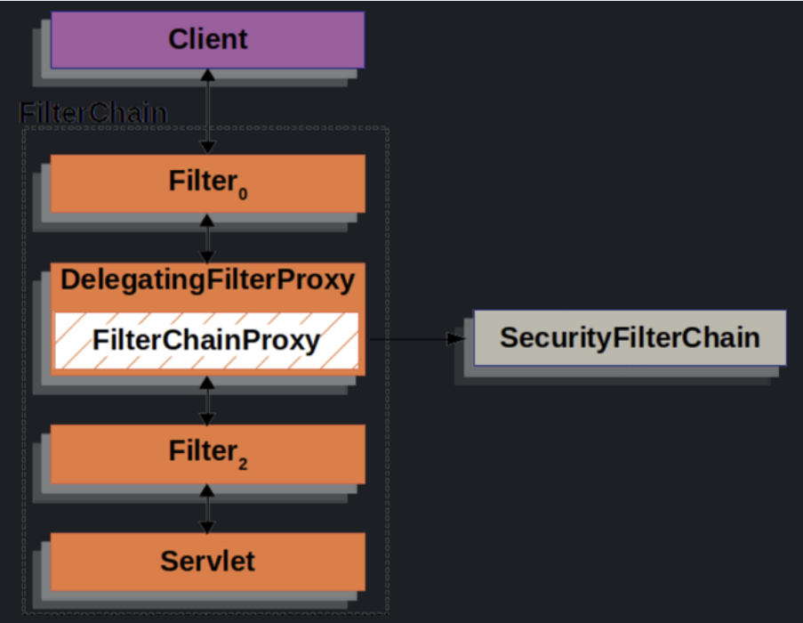
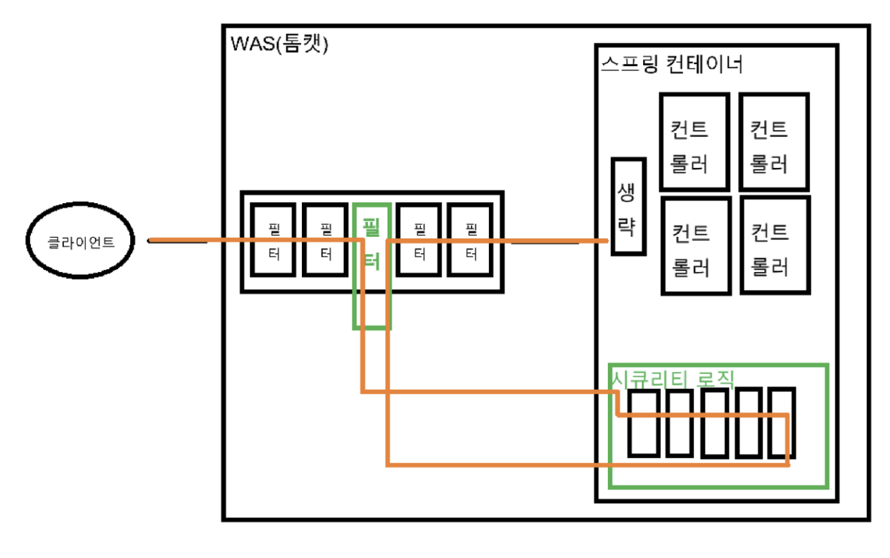

# 스프링 시큐리티 내부 구조 개념

## 전반적인 동작 원리

### 시큐리티 의존성이 없는 경우

- 클라이언트의 요청은 서버 컴퓨터의 WAS(톰캣)의 필터들을 통과한 뒤 스프링 컨테이너의 컨트롤러에 도달한다
- 컨트롤러 앞단에 `DispatcherServlet` 통해 `Handler`를 찾는 여러 과정이 있다

   

### 시큐리티 의존성 추가 후

 
- WAS의 필터단에서 요청을 가로챈 후 시큐리티의 역할을 수행한다
- 순서
  - WAS의 필터에 하나의 필터를 만들어서 넣고 해당 필터에서 요청을 가로챈다
  - 해당 요청은 스프링 컨테이너 내부에 구현되어 있는 스프링 시큐리티 감시 로직을 거친다
  - 시큐리티 로직을 마친 후 다시 WAS의 다음 필터로 복귀한다

- 클라이언트 요청이 필터단을 거치면서 `DelegatingFilterProxy`와 `FilterChainProxy`가 요청을 가로챈다
  - `DelegatingFilterProxy`: 스프링 `Bean`을 찾아 요청을 넘겨주는 서블릿 필터
  - `FilterChainProxy`: 스프링 시큐리티 의존성을 추가하면 `DelegatingFilterProxy`에 의해 호출되는 `SecurityFilterChain`들을 들고 있는 `Bean`
- 가로챈 요청을 `SecurityFilterChain`에 보내 시큐리티 로직을 거치고 다시 다음 필터로 복귀한다

### 스프링 시큐리티 로직 구성

- 스프링 시큐리티 로직은 여러개의 필터들이 나열된 체인 형태로 구성되어 있다
- 각각의 필터에서 CSRF, 로그아웃, 로그인, 인가 등 여러 작업을 수행한다
- 시큐리티 필터 체인은 일연의 과정들을 수행하는 필터들의 묶음이다
- 여러개의 시큐리티 필터 체인을 가질 수 있다
   