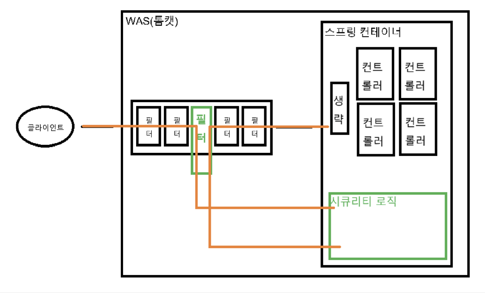
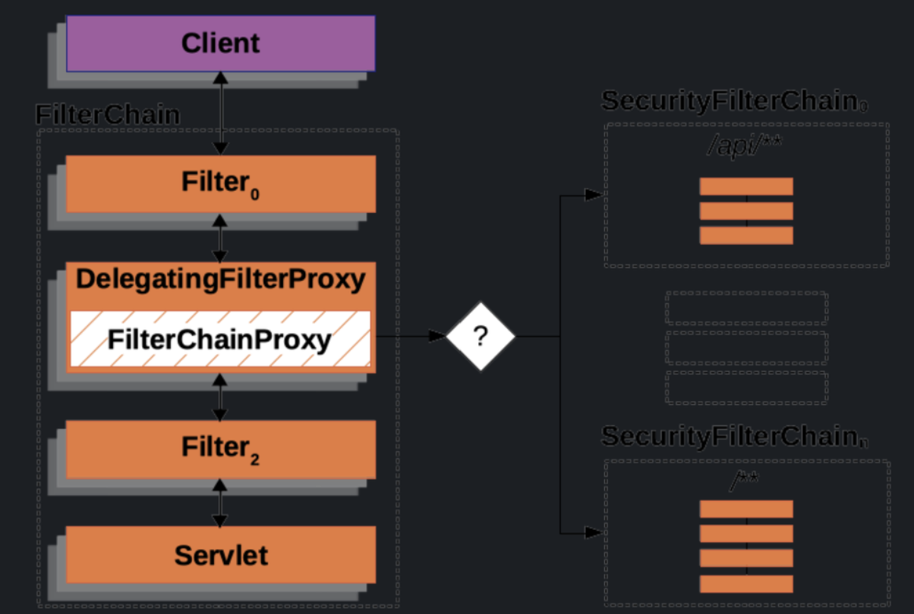
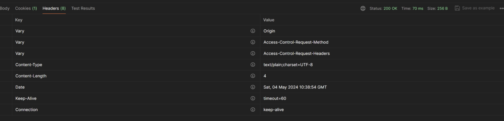
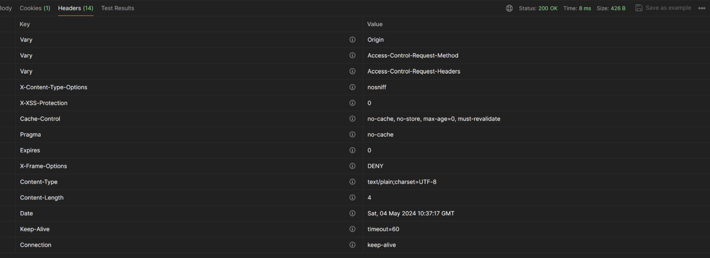
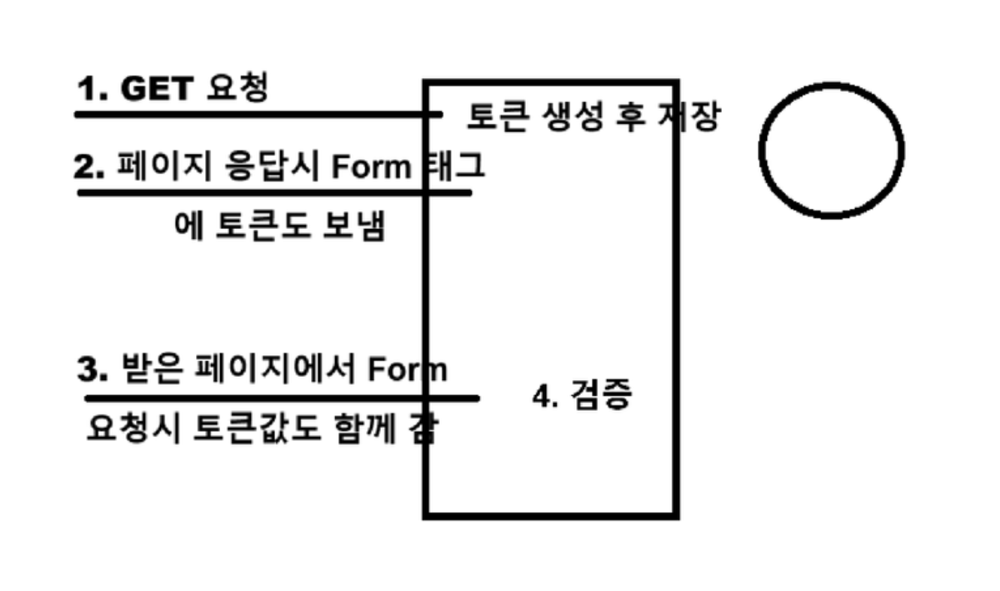
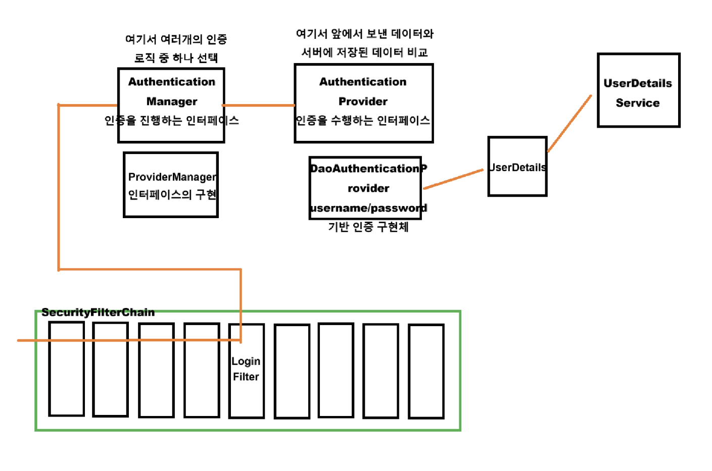

# 스프링 시큐리티 내부 구조 개념

## 전반적인 동작 원리

### 시큐리티 의존성이 없는 경우

- 클라이언트의 요청은 서버 컴퓨터의 WAS(톰캣)의 필터들을 통과한 뒤 스프링 컨테이너의 컨트롤러에 도달한다
- 컨트롤러 앞단에 `DispatcherServlet` 통해 `Handler`를 찾는 여러 과정이 있다
   

### 시큐리티 의존성 추가 후
 
- WAS의 필터단에서 요청을 가로챈 후 시큐리티의 역할을 수행한다
- 순서
  - WAS의 필터에 하나의 필터를 만들어서 넣고 해당 필터에서 요청을 가로챈다
  - 해당 요청은 스프링 컨테이너 내부에 구현되어 있는 스프링 시큐리티 감시 로직을 거친다
  - 시큐리티 로직을 마친 후 다시 WAS의 다음 필터로 복귀한다


- 클라이언트 요청이 필터단을 거치면서 `DelegatingFilterProxy`와 `FilterChainProxy`가 요청을 가로챈다
  - `DelegatingFilterProxy`: 스프링 `Bean`을 찾아 요청을 넘겨주는 서블릿 필터
  - `FilterChainProxy`: 스프링 시큐리티 의존성을 추가하면 `DelegatingFilterProxy`에 의해 호출되는 `SecurityFilterChain`들을 들고 있는 `Bean`
- 가로챈 요청을 `SecurityFilterChain`에 보내 시큐리티 로직을 거치고 다시 다음 필터로 복귀한다

### 스프링 시큐리티 로직 구성

- 스프링 시큐리티 로직은 여러개의 필터들이 나열된 체인 형태로 구성되어 있다
- 각각의 필터에서 CSRF, 로그아웃, 로그인, 인가 등 여러 작업을 수행한다
- 시큐리티 필터 체인은 일연의 과정들을 수행하는 필터들의 묶음이다
- 여러개의 시큐리티 필터 체인을 가질 수 있다
   

## DelegatingFilterProxy, FilterChainProxy

### DelegatingFilterProxy
- 클라이언트의 요청을 가로채서 스프링 컨테이너에 들어 있는 `FilterChainProxy`로 요청을 던져준다
- 요청을 전달하는 매개체 역할이다
- 스프링 시큐리티 의존성을 추가하면 `SecurityAutoConfiguration`를 통해 자동 등록된다
  - `SecurityAutoConfiguration`은 스프링 시큐리티 의존성 내부에 포함되어 있다

### FilterChainProxy
- `DelegatingFilterProxy`로 부터 요청을 전달 받는다
- 등록되어 있는 시큐리티 필터 체인들 중 요청에 알맞은 시큐리티 필터 체인에 요청을 전달한다 

## SecurityFilterChain 등록

### DefaultSecurityFilterChain
- 스프링 시큐리티 의존성을 추가하면 기본적인 `DefaultSecurityFilterChain` 하나가 등록된다
  - 어플리케이션을 실행하면 기본적으로 사용할 수 있는 로그인 창 같은 기능을 제공한다

### 커스텀 SecurityFilterChaine 등록 
- 내가 원하는 `SecurityFilterChain`을 등록하기 위해서는 `SecurityFilterChain`을 리턴하는 `@Bean` 메서드를 등록하면 되고 여러개 등록할 수 있다
  ```java
	@Configuration
	@EnableWebSecurity
	public class SecurityConfig {

			@Bean
			public SecurityFilterChain filterChain1(HttpSecurity http) throws Exception{

					return http.build();
			}

			@Bean
			public SecurityFilterChain filterChain2(HttpSecurity http) throws Exception {

					return http.build();
			}
	}
  ``` 
### 멀티 SecurityFilterChain 중 하나 선택
- `FilterChainProxy`는 N개의 `SecurityFilterChain` 중 하나를 선택해서 요청을 전달한다
- 선택 기준은 아래와 같다
  - 등록 인덱스 순
  - 필터 체인에 대한 `RequestMatcher` 값이 일치하는지 확인
    - 여기서 `RequestMatcher`는 인가 작업이 아닌 `SecurityFilterChain`에 대한 `RequestMatcher` 설정으로 아래에서 설명한다

### 멀티 SecurityFilterChain 경로 설정 (필수)
- 경로 설정을 하지 않으면 아래와 같은 문제가 발생할 수 있다
  - N개의 `SecurityFilterChain`이 모두 `"/**"` 경로에서 매핑된다
  - 모든 요청이 첫번째로 등록되어 있는 `SecurityFilterChain`만 거치게 된다 
 
- 문제 상황 예시
	```java
	@Bean
	public SecurityFilterChain filterChain1(HttpSecurity http) throws Exception {

			http.authorizeHttpRequests((auth) -> auth.requestMatchers("/user").permitAll());

			return http.build();
	}

	@Bean
	public SecurityFilterChain filterChain2(HttpSecurity http) throws Exception {

			http.authorizeHttpRequests((auth) -> auth.requestMatchers("/admin").permitAll());

			return http.build();
	}
	``` 
	- 2개의 커스텀 `SecurityFilterChain`을 등록하고 각각 `"/user`, `"/admin"` 경로에 대해서 `permitAll()` 설정을 한다
	- 이후 `"/admin"` 경로로 요청을 보내면 별다른 인증 과정없이 컨트롤러로 연결된다고 생각하겠지만 예상치 못한 응답이 발생한다
	- 그 이유는 `filterChain1`이 `filterChain2` 보다 먼저 등록되어 있고 `SecurityFilterChain`에 대한 경로 설정을 하지 않았기 때문에 `filterChain1`, `filterChain2` 모두 `"/**"` 경로에 대해서 반응하기 때문이다
	- 따라서, `"/admin"` 경로로 보낸 요청은 `filterChain1`으로 전달되고 `filterChain1` 내부에는 `"/admin"`에 대한 설정이 없기 때문에 요청이 거부된다

- 해결 방법 예시 
  ```java
	@Bean
	public SecurityFilterChain filterChain1(HttpSecurity http) throws Exception {

			http
				.securityMatchers((auth) -> auth.requestMatchers("/user"))
				.authorizeHttpRequests((auth) -> auth.requestMatchers("/user").permitAll());

			return http.build();
	}

	@Bean
	public SecurityFilterChain filterChain2(HttpSecurity http) throws Exception {

			http
				.securityMatchers((auth) -> auth.requestMatchers("/admin"))
				.authorizeHttpRequests((auth) -> auth.requestMatchers("/admin").authenticated());

			return http.build();
	}
	``` 
	- `securityMatchers()`를 통해서 `SecurityFilterChain`에 대한 경로 설정(`RequestMatcher`)을 추가한다
	  - `filterChain1` -> `"/user"`
	  - `filterChain2` -> `"/admin"`

### 멀티 SecurityFilterChain 순서 설정 (선택)
- N개의 `SecurityFilterChain`을 만들고 등록되는 순서를 직접 지정하고 싶다면 `@Order` 어노테이션을 사용하면 된다
  ```java
	@Bean
	@Order(1)
	public SecurityFilterChain filterChain1(HttpSecurity http) throws Exception{

			return http.build();
	}

	@Bean
	@Order(2)
	public SecurityFilterChain filterChain2(HttpSecurity http) throws Exception {

			return http.build();
	}
	``` 

### 특정 요청은 필터를 거치지 않도록 설정

- `SecurityFilterChain`은 내부적으로 여러 가지 필터를 거치게 된다
- 이때, 서버의 자원을 사용하고 처리 시간이 발생하기 때문에 특정 요청은 필터를 거치지 않도록 설정할 수 있다
- 보통 정적 자원(이미지, CSS)의 경우 필터를 통과하지 않도록 설정한다
- 설정 시 필터 체인 내부에 필터가 없는 `SecurityFilterChain` 하나가 0번 인덱스로 설정된다
  ```java
	@Bean
	public WebSecurityCustomizer webSecurityCustomizer() {

			return web -> web.ignoring().requestMatchers("/img/**");
	}
	``` 

## SecurityFilterChain 내부 구조

### SecurityFilterChain
- `SecurityFilterChain`은 스프링 시큐리티의 보안, 인증/인가 같은 주요 로직을 담당한다
- 하나의 `SecurityFilterChain` 내부에 N개의 필터를 구성하여 각각의 필터가 하나의 로직(로그아웃, 로그인 등등) 수행의 시작점이 된다

### SecurityFilterChain에 등록된 필터 확인
- 기본 `SecurityFilterChain` 상태의 필터 목록
  ```java
	@Configuration
	@EnableWebSecurity(debug = true)
	public class SecurityConfig {

	}
	``` 
   

- 커스텀 `SecurityFilterChain` 등록 시 필터 목록
  ```java
	@Configuration
	@EnableWebSecurity(debug = true)
	public class SecurityConfig {

			@Bean
			public SecurityFilterChain filterChain1(HttpSecurity http) throws Exception {

					return http.build();
			}
	}
	``` 
	

### 스프링 시큐리티 제공 필터와 역할
- `DisableEncodeUrlFilter`
  - URL로 간주되지 않는 부분을 포함하지 않도록 설정
  - 시큐리티에서 처리하지 않는 파라미터 값 등을 제외시킨다
- `WebAsyncManagerIntegerationFilter`
  - 비동기로 처리되는 작업에 대해 알맞은 시큐리티 컨텍스트(세션)을 적용
  - 동일한 세션에 할당을 시켜준다
- `SecurityContextHolderFilter`
  - 접근한 유저가 이미 로그인되어 세션에 해당 정보가 있다면 동일한 세션을 매칭시켜준다
  - 처음 접속하는 유저는 새로운 세션을 만들어준다
- `HeaderWriterFilter`
  - 보안을 위한 응답 헤더 추가(`X-Frame-Option`, `X-Content-Type-Options` 등)
- `CorsFilter`
  - `CORS` 설정 필터
- `CsrfFilter`
  - `CSRF` 방어 필터
- `LogoutFilter`
  - 로그아웃 요청 처리의 시작점이 되는 필터
- `UsernamePasswordAuthenticationFilter`
  - Username/Password 기반 로그인 처리 시작점이 되는 필터
- `DefaultLoginPageGeneratingFilter`
  - 기본 로그인 페이지를 생성해주는 필터
- `DefaultLogoutPageGeneratingFilter`
  - 기본 로그아웃 페이지를 생성해주는 필터
- `BasicAuthenticationFilter`
  - `HTTP Basic` 기반 로그인 처리 시작점이 되는 필터
- `RequestCacheAwareFilter`
  - 이전 요청 정보가 존재하면 처리 후 현재 요청으로 판단
  - 로그인 페이지로 리다이렉트 되고 로그인을 하면 이전 요청을 재개
- `SecurityContextHolderAwareRequestFilter`
  - `ServletRequest`의 시큐리티 관련 API를 제공하는 필터
- `AnonymousAuthenticationFilter`
  - 최초 접속으로 인증 정보가 없고 인증을 하지 않았을 경우 익명 사용자로 초기화 설정을 해주는 필터
- `ExceptionTranslationFilter`
  - 인증/인가에 실패한 경우 예외에 대한 처리를 해주는 필터
- `AuthorizationFilter`
  - 경로 및 권한별 인가 작업을 진행하는 필터

### SecurityFilterChain에서 필터 활성/비활성화
```java
// CORS 필터 
http.cors((cors) -> cors.disable());

// CSRF 필터
http.csrf((csrf) -> csrf.disable());

// UsernamePasswordAuthenticationFilter
http.formLogin(withDefaults());
http.formLogin((login) -> login.disable());

// 로그인 / 로그아웃 페이지 필터
// formLogin 활성화 시 기본적으로 활성화 (커스텀 시 기본 필터 비활성화)
http.formLogin((login) -> login.loginPage("/login").permitAll());

// BasicAuthenticationFilter
http.httpBasic(withDefaults());
http.httpBasic((basic) -> basic.disable());
```

### SecurityFilterChain에 커스텀 필터 등록
```java
// 특정 필터 이전
http.addFilterBefore(추가할필터, 기존필터.class);

//특정 필터 위치
http.addFilterAt(추가할필터, 기존필터.class);

//특정 필터 이후
http.addFilterAfter(추가할필터, 기존필터.class);
```

## SecurityContextHolder

### SecurityHolder가 필요한 이유

- `SecurityFilterChain` 내부에 존재하는 각각의 필터가 시큐리티 관련 작업을 진행한다
- 모든 작업은 기능 단위로 분업하여 진행함으로 앞에서 한 작업을 뒤에 있는 필터가 알기 위한 저장소 개념이 필요하다
- 예를 들어, 인가 필터가 작업을 하려면 유저의 ROLE 정보가 필요하기에 앞단의 필터에서 유저에게 부여한 ROLE 값을 인가 필터까지 공유해야 한다

### Authentication 객체

- 유저 정보는 `Authentication`이라는 객체에 담긴다
  - 이 객체에는 아이디, 로그인 여부, ROLE 등의 데이터가 담긴다
- `Authentication` 객체는 `SecurityContext`에 포함되어 관리되며 `SecurityContext`는 0개 이상 존재할 수 있다
- 그리고 이 N개의 `SecurityContext`는 하나의 `SecurityContextHolder`에 의해 관리된다
- 객체 구조
  - `Principal`: 유저에 대한 정보
  - `Credentials`: 증명(비밀번호, 토큰)
  - `Authorities`: 유저의 권한(ROLE) 목록
- 접근 방법
  ```java
	SecurityContextHolder.getContext().getAuthentication().getPrincipal();
	SecurityContextHolder.getContext().getAuthentication().getCredentials();
	SecurityContextHolder.getContext().getAuthentication().getAuthorities();
	``` 
	- `SecurityContextHolder`의 메서드는 `static`으로 선언되기 때문에 어디서든 접근할 수 있다
- 특이사항
  - 스프링은 멀티 쓰레드 환경에서 다수의 사용자가 접근할 수 있다
  - 각 사용자들은 `SecurityContext`를 부여 받는다
  - 이때, 사용자 별로 다른 저장소를 제공해야 인증 정보가 겹치는 일이 발생하지 않는다
  - 따라서, `SecurityContextHolder`를 통해 `SecurityContext`를 관리하는 전략은 다른 클래스에 위임한다
  - 즉, `SecurityContextHolder`는 `SecurityContext`를 관리하는 메서드를 제공하지만 실제로 등록, 초기화, 읽기와 같은 작업은 `SecuritytContextHolderStrategy` 인터페이스에 맡긴다

### SecurityContextHolderStrategy 구현 종류
```java
private static void initializeStrategy() {

	if (MODE_PRE_INITIALIZED.equals(strategyName)) {
		Assert.state(strategy != null, "When using " + MODE_PRE_INITIALIZED
				+ ", setContextHolderStrategy must be called with the fully constructed strategy");
		return;
	}
	if (!StringUtils.hasText(strategyName)) {
		// Set default
		strategyName = MODE_THREADLOCAL;
	}
	if (strategyName.equals(MODE_THREADLOCAL)) {
		strategy = new ThreadLocalSecurityContextHolderStrategy();
		return;
	}
	if (strategyName.equals(MODE_INHERITABLETHREADLOCAL)) {
		strategy = new InheritableThreadLocalSecurityContextHolderStrategy();
		return;
	}
	if (strategyName.equals(MODE_GLOBAL)) {
		strategy = new GlobalSecurityContextHolderStrategy();
		return;
	}
	// Try to load a custom strategy
	try {
		Class<?> clazz = Class.forName(strategyName);
		Constructor<?> customStrategy = clazz.getConstructor();
		strategy = (SecurityContextHolderStrategy) customStrategy.newInstance();
	}
	catch (Exception ex) {
		ReflectionUtils.handleReflectionException(ex);
	}
}
```

### ThreadLocal 방식에서 SecurityContext

- `SecurityContextHolderStrategy`는 기본적으로 `threadLocal` 방식을 사용한다
- 톰캣 WAS는 멀티 쓰레드 방식으로 동작한다
- 유저가 접속하면 유저에게 하나의 쓰레드를 할당한다
- 각각의 유저는 동시에 시큐리티 로그인 로직을 사용할 수 있다
- 이때, `SecurityContextHolder`의 `static` 필드에 선언된 `SecurityContext`를 호출하면 쓰레드간 공유하는 메모리의 code 영역에 데이터가 있기 때문에 정보가 덮어지는 현상이 발생할 것 같지만 `threadLocal`로 관리되기 때문에 쓰레드별 다른 구역을 나눠 제공한다

### SecurityContext의 생명 주기
- `Authentication` 객체를 관리하는 `SecurityContext`는 사용자의 요청이 서버로 들어오면 생성되고 요청의 처리가 끝난 후 응답되는 순간에 초기화 된다

## 필터 상속과 요청 전파

### 필터의 상속

- 각각의 필터의 조상은 모두 동일하다
- 필터의 기반이 되는 필터 클래스를 만들어두고 해당 클래스를 상속 받아 각 특성에 맞게 구현되어 있다
- 상속의 이점
  - 중복되는 코드를 줄이고 각각의 구현부가 자신이 가지는 책임에 대해서만 작업을 수행한다
  - 예를 들어 로그인 필터의 경우 로그인의 종류가 아주 많기 때문에 기본적인 로그인 틀을 구현하고 이를 상속 받아 세부적인 로그인 방식을 구현한 필터를 등록할 수 있다

### GenericFilterBean과 OncePerRequestFilter
- 서블릿 기반의 `Filter` 인터페이스 바로 아래에 내려가면 `GenericFilterBean`과 `OncePerRequestFilter` 두 가지 추상 클래스가 존재하며 모든 필터는 두 추상 클래스를 기반으로 구현되어 있다
- `GenericFilterBean`
  ```java
	public abstract class GenericFilterBean implements Filter, BeanNameAware, EnvironmentAware,
			EnvironmentCapable, ServletContextAware, InitializingBean, DisposableBean {

	}
	``` 
	- `GenericFilterBean` 추상 클래스는 자바 서블릿 필터 기반으로 구현되어 있으며 자바 서블릿 영역에서 스프링 영역에 접근할 수 있도록 작성되어 있다
- `OncePerRequestFilter`
  ```java
	public abstract class OncePerRequestFilter extends GenericFilterBean {

		protected abstract void doFilterInternal(HttpServletRequest request, HttpServletResponse response, FilterChain filterChain) throws ServletException, IOException;

	}
	``` 
	- `OncePerRequestFilter`는 `GenericFilterBean`을 기반으로 작성된 추상 클래스로 클라이언트의 한 번의 요청에 대해 내부적으로 동일한 서블릿 필터를 여러번 거칠 경우 한번만 반응하도록 설계되어 있다

### 필터의 형식
```java
public interface Filter {

    default void init(FilterConfig filterConfig) throws ServletException {
    }


    void doFilter(ServletRequest request, ServletResponse response, FilterChain chain)
            throws IOException, ServletException;


    default void destroy() {
    }
}
```
- 인터페이스로 3가지 메서드를 정의해 두었다
  - `init()`
    - 서블릿 컨테이너 실행 시 필터를 생성하고 초기화 할 때 사용하는 메서드
  - `doFilter()`
    - 요청에 대한 작업 수행 및 다음 필터를 호출하는 메서드
  - `destroy()`
    - 서블릿 컨테이너 종료 시 초기화하는 메서드

### filterChain에서 다음 필터 호출
```java
public class LogoutFilter extends GenericFilterBean {

	@Override
	public void doFilter(ServletRequest request, ServletResponse response, FilterChain chain)
			throws IOException, ServletException {
		doFilter((HttpServletRequest) request, (HttpServletResponse) response, chain);
	}

	private void doFilter(HttpServletRequest request, HttpServletResponse response, FilterChain chain)
			throws IOException, ServletException {
			
		//처리할 로직
		//System.out.println("before");

		//다음 필터 호출
		chain.doFilter(request, response);
		
		//요청이 돌아서 다시 현재 필터를 통과할 때 처리할 로직
		//System.out.println("after");
	}

}
```
- `GenericFilterBean`
  - `doFilter()`
- `OncePerRequestFilter`
  - `doFilterInternal()`

## GenericFilterBean, OncePerRequestFilter

### GenericFilterBean vs OncePerRequestFilter
- `SecurityFilterChain`에 담겨 있는 필터는 `GenericFilterBean`을 기반으로 구현한 필터가 있고 `GenericFilterBean`을 상속한 `OncePerRequestFilter`를 기반으로 구현한 필터도 있다
- 두 방식의 차이점의 기준은 클라이언트의 한번의 요청에 대해서이다
- `GenericFilterBean`은 내부적으로 동일한 필터를 여러 번 거치더라도 그 수 만큼 내부 로직이 실행된다
- `OncePerRequestFilter`는 내부적으로 동일한 필터를 여러 번 거치면 처음 한번만 내부 로직이 실행된다

## DisableEncodeUrlFilter

### DisableEncodeUrlFilter의 목적
- 이 필터는 `DefaultSecurityFilterChain`에 기본적으로 등록되는 필터로 가장 처음에 위치한다
- 필터를 등록하는 목적은 URL 파라미터에 세션 id가 인코딩되어 로그로 유출되는 것을 방지하기 위함이다
- 커스텀 `SecurityFilterChain`을 생성해도 등록이 되며 비활성화는 `SecurityConfig`에서 세션 관리 설정을 disable 하면 된다

## WebAsyncManagerIntegrationFilter

### WebAsyncManagerIntegrationFilter의 목적
- 이 필터는 `DefaultSecurityFilterChain`에 기본적으로 등록되는 필터로 두번째에 위치한다
- 필터를 등록하는 목적은 서블릿단에서 비동기 작업을 수행할 때 서블릿 입출력 쓰레드와 작업 쓰레드가 동일한 `SecurityContextHolder`의 `SecurityContext` 영역을 참조할 수 있도록 하기 위함이다
- 즉, `SecurityContextHolder`의 `ThreadLocal` 전략에 따라 동일한 쓰레드에서만 `SecurityContext`에 접근할 수 있는데 비동기 방식의 경우 하나의 작업을 2개의 쓰레드로 수행하기 때문에 이 부분을 보완하기 위한 필터이다
- 커스텀 `SecurityFilterChain`을 생성해도 자동으로 등록이 된다

### Callable 사용 시 
```java
@GetMapping("/async")
@ResponseBody
public Callable<String> asyncPage() {

    System.out.println("start" + SecurityContextHolder.getContext().getAuthentication().getName());

    return () -> {
        Thread.sleep(4000);
        System.out.println("end" + SecurityContextHolder.getContext().getAuthentication().getName());

        return "async";
    };
}
```
- 위와 같은 코드는 `Callable<>` 인터페이스로 감싸 반환이 되는 부분을 다른 쓰레드에서 수행하게 된다
- API 내부의 출력과 반환문 안의 출력은 각기 다른 쓰레드에서 수행되지만 `ThreadLocal`로 관리되는 `SecurityContextHolder`의 값은 `WebAsyncManagerIntegrationFilter`와 다른 클래스들을 통해 동일하게 가져올 수 있다

### 서블릿단에서 비동기 처리인데 어떻게 필터단에서 판단하는걸까?
- `WebAsyncManagerIntegrationFilter`는 필터단에 존재하는데 어떻게 필터단 이후에 컨트롤러단에서 발생하는 쓰레드 문제를 처리할 수 있는 걸까?
- 그 이유는 `WebAsyncManagerIntegrationFilter`가 실제로 수행하는 작업과 `Callable`의 동작 방식에 관련이 있다

### WebAsyncManagerIntegrationFilter가 실제로 수행하는 작업
- `WebAsyncManagerIntegrationFilter`는 현재 쓰레드의 `SecurityContext`를 다룰 수 있는 `SecurityContextCallableProcessingInterceptor`를 `WebAsyncManager`에 등록만 한다
- 이후 서블릿단에서 `WebAsyncManager`를 통해 새로운 쓰레드에 `SecurityContext`를 복사한다

### Callable 동작 방식과 DispatcherServlet
- 사용자의 요청은 필터단을 모두 거친 후 스프링 컨테이너에서 컨트롤러에 접근하게 된다
- 이때, 컨트롤러 바로 전에 `DispatcherServlet`이라는 서블릿이 존재하는데 사용자의 요청과 알맞은 컨트롤러(`Handler`)를 찾는 역할을 수행한다
- `Callable` 수행 과정
  - `DispatcherServlet`에서 알맞은 `Controller`를 찾아서 요청 전달
  - `Controller`에서 요청 수행 후 `Callable` 부분을 `DispatcherServlet`으로 리턴
  - `DispatcherServlet`은 `Callable` 객체를 `WebAsyncManager`에게 전달
  - `WebAsyncManager`가 비동기 부분을 새로운 쓰레드에서 수행 후 응답
- `WebAsyncManager`는 `WebAsyncManagerIntegrationFilter`에 의해 기존 쓰레드가 참조하던 `SecurityContext`를 전달 받았기 때문에 `Callable`을 수행할 새로운 쓰레드에게 기존 `SecurityContext`를 전달할 수 있다

## SecurityContextHolderFilter

### SecurityContextHolderFilter의 목적
- 이 필터는 `DefaultSecurityFilterChain`에 기본적으로 등록되는 필터로 세번째에 위치한다
- 필터를 등록하는 목적은 이전 요청을 통해 이미 인증한 사용자 정보를 현재 요청의 `SecurityContextHolder`의 `SecurityContext`에 할당하는 역할을 수행하고 현재 요청이 끝나면 `SecurityContext`를 초기화한다
- 커스텀 `SecurityFilterChain`을 생성해도 자동 등록되고 비활성화가 가능하다
  ```java
	@Bean
	public SecurityFilterChain filterChain(HttpSecurity http) throws Exception {

			http.securityContext((context) -> context.disable());

			return http.build();
	}
	``` 
	- `JWT` 같이 세션을 `STATELESS`하게 유지하는 환경에서도 `SecurityContext`를 비워주는 역할이 필요할 수 있기 때문에 비활성화는 권장되지 않는다

### 기본 로직
- 이전 요청에서 사용자가 로그인을 했고 세션이 `STATELESS` 상태가 아니라면 서버의 세션(메모리) 또는 레디스와 같은 저장 매체에 유저의 정보가 있을 것이다
- 해당 저장 매체로부터 유저의 정보를 가져올 때 `SecurityContextRepository`라는 인터페이스의 `loadDeferredContext()` 메서드를 사용해서 불러온다
  - 만약 유저의 정보가 존재하지 않는다면 빈 객체를 응답한다
- 이후 불러온 유저 정보를 `SecurityContextHolder`에 `setDefferedContext()` 메서드를 사용해서 저장하고 다음 필터로 넘어간다
- 응답이 이루어지면 `finally` 구문을 통해 `SecurityContextHolder`에서 유저 정보를 제거한다

## HeaderWriterFilter

### HeaderWriterFilter의 목적
- 이 필터는 `DefaultSecurityFilterChain`에 기본적으로 등록되는 필터로 네번째에 위치한다
- 필터를 등록하는 목적은 HTTP 응답 헤더에 사용자 보호를 위한 시큐리티 관련 헤더를 추가하기 위함이다
- 커스텀 `SecurityFilterChain`을 생성해도 자동으로 등록되고 비활성화가 가능하다
  ```java
	http.headers((headers) -> headers.disable());
	``` 

### 헤더 목록
- 응답 헤더에 시큐리티 관련 헤더를 추가하는 시점은 설정에 따라 2종류로 현재 필터를 통과하는 순간 또는 서블릿에서 응답을 보내며 다시 이 필터를 통과하는 시점으로 나눠진다
- 기본값은 서블릿에서 응답을 보내면서 이 필터롤 통과할 때이다
- 필터 적용 전 응답 헤더
  
- 필터 적용 후 응답 헤더
  
- `HeaderWriterFilter` 기본으로 추가되는 헤더
  |Key                   |Description                                                 |
	|:---------------------|:----------------------------------------------------------:| 
	|`X-Content-Type-Options`| 컨텐츠 스니핑을 막기 위해 `nosniff value`를 할당해 서버에서 응답하는 `Content-Type`과 다른 타입일 경우 읽지 못하도록 설정|
	|`X-XSS-Protection`| XSS 공격 감지 시 로딩 금지|
	|`Cache-Control`| 이전에 받았던 데이터와 현재 보낼 데이터가 같다면 로딩에 대한 여부|
	|`Pragma`| HTTP/1.0 방식에서 사용하던 `Cache-Control`|
	|`Expires`| 서버에서 보낼 데이터를 브라우저에서 캐싱할 시간|
	|`X-Frame-Options`| 브라우저가 응답 데이터를 iframe, frame, embed, object 태그에서 로딩해도 되는 여부

## CorsFilter

### CorsFilter의 목적
- 이 필터는 `DefaultSecurityFilterChain`에 기본적으로 등록되는 필터로 다섯번째에 위치한다
- 필터를 등록하는 목적은 `CorsConfigurationSource`에 설정한 값에 따라 필터단에서 응답 헤더를 설정하기 위함이다
- 커스텀 `SecurityFilterChain`을 생성해도 자동으로 등록되며 비활성화가 가능하다
  ```java
	http.cors((cors) -> cors.disable());
	``` 
>참고:  
API 서버를 구축할 때 프론트와 백엔드의 Origin이 다르면 CORS 문제가 발생한다  
문제 해결을 위해서는 `SecurityFilterChain`의 `CorsConfigurationSource` 값을 설정하는게 중요하다

### GenericFilter
- `CorsFilter`는 스프링 시큐리티를 구성하는 다른 필터들과 다르게 `GenericFilterBean` 추상 클래스가 아닌 `GenericFilter` 추상 클래스를 상속 받는다
- 두 추상 클래스 모두 `Filter` 인터페이스를 구현하지만 `GenericFilter`는 스프링에서 사용하는 `POJO`이기 때문에 엄밀히 말하면 스프링과 연관이 없고 Bean으로 관리되지 않는다
- `CorsFilter`는 스프링 시큐리티 의존성에 포함된 것이 맞지만 시큐리티를 위해 처음부터 개발된 것이 아니다
- 즉, 시큐리티 이전의 자바 서블릿 생태계에서 이미 존재했기 때문에 `GenericFilter` 기반으로 구현되어 있다

## CsrfFilter

### CsrfFilter의 목적
- 이 필터는 `DefaultSecurityFilterChain`에 기본적으로 등록되는 필터로 여섯번째에 위치한다
- 필터를 등록하는 목적은 CSRF 공격을 방어하기 위해 HTTP 메서드 중 GET, HEAD, TRACE, OPTIONS 메서드를 제외한 요청에 대해서 검증을 진행하기 위함이다
- 스프링 시큐리티의 CSRF 검증 방식은 토큰 방식이며 요청 시 토큰을 서버 저장소에 저장 후 클라이언트에게 전송한다
- 그 후 해당하는 요청에 대해서 서버에 저장된 토큰과 비교 검증을 한다
   
- 커스텀 `SecurityFilterChain`을 생성해도 자동으로 등록되며 비활성화가 가능하다
  ```java
	http.csrf((csrf) -> csrf.disable())
	``` 
>참고:  
CSRF 공격은 사용자의 의지와 무관하게 해커가 강제로 사용자의 브라우저를 통해 서버측으로 특정한 요청을 보내도록 공격하는 방법이다 

### CsrfTokenRepository
- CSRF 토큰의 생성 및 관리는 `CsrfTokenRepository`라는 인터페이스를 정의하고 이를 구현한 클래스에게 위임한다
  - `HttpSessionCsrfTokenRepository`: 서버 세션에 토큰을 저장/관리함 (기본값)
  - `CookieCsrfTokenRepository`: 쿠키에 토큰을 저장/관리함
  - 직접 구현도 가능

### CSRF 토큰 발급
- 기본 동작은 SSR 세션 방식으로 설정되어 있다
  - `STATELESS`한 REST API에서는 사용할 일이 없기 때문
- `Controller`단에서 `VIEW`단으로 응답 시 `HTML`의 `Form` 영역에 서버에 저장되어 있는 `_csrf` 토큰 값을 넣어주면 된다

### CSRF Referer
- `STATELESS`한 REST API 서버를 구축한다면 `JSESSION`에 대한 서버 세션이 상태를 가지지 않기 때문에 CSRF 공격 위험 자체가 없다
- 따라서, CSRF 설정을 disable하는게 일반적인 구현이다
- 하지만, JWT를 쿠키에 저장할 경우 CSRF 공격의 위험이 있기 때문에 활성화 하는 것이 좋다
- 다만 CSRF 토큰을 발급할 `VIEW` 페이지와 같은 로직이 없기 때문에 토큰 방식이 아닌 `Referer` 방식을 사용한다
  - 이 방식은 `HTTP Referer` 헤더를 통해 요청의 출발점, 이전 URL등을 검증한다

## LogoutFilter

### LogoutFilter의 목적
- 이 필터는 `DefaultSecurityFilterChain`에 기본적으로 등록되는 필터로 일곱번째에 위치한다
- 이 필터를 등록하는 목적은 인증 후 생성되는 사용자 식별 정보를 로그아웃 핸들러를 통해 로그아웃을 수행하기 위함이다
- 기본적으로 세션 방식에 대한 로그아웃 설정이 되어 있기 때문에 JWT 방식을 사용하거나 추가할 로직이 많을 경우 커스텀 해야 한다
- 커스텀 `SecurityFilerChain`을 생성해도 자동으로 등록되며 비활성화가 가능하다
  ```java
	http.logout((logout) -> logout.disable());
	``` 

### LogoutHandler
- 로그아웃 핸들러들은 `LogoutHandler` 인터페이스를 구현한 클래스들로 이루어져 있으며 커스텀 핸들러 생성 시에도 `LogoutHandler` 인터페이스 기반으로 작성해야 한다
- 기본 제공 핸들러
  - `SecurityContextLougoutHandler`: `SecurityContenxtHolader`에 존재하는 `SecurityContext` 초기화
  - `CookieClearingLoguoutHandler`: `SecurityFilterChain`의 `logout` 메서드에서 지정한 쿠키 삭제
  - `HeaderWriterLogoutHandler`: 클라이언트에게 반활될 헤더 조작
  - `LogoutSuccessEventPublishingLogoutHandler`: 로그아웃 성공 후 특정 이벤트 실행
- `CompositeLogoutHandler` 클래스에서 등록된 모든 로그아웃 핸들러를 순회하면서 로그아웃을 수행한다

## UsernamePasswordAuthenticationFilter

### UsernamePasswordAuthenticationFilter의 목적
- 이 필터는 `DefaultSecurityFilterChain`에 기본적으로 등록되는 필터로 여덟번째에 위치한다
- 필터를 등록하는 목적은 `POST: /login` 경로에서 Form 기반 인증을 진행할 수 있도록 `multipart/form-data` 형태의 username/password 데이터를 받아 인증 클래스에게 값을 넘겨주기 위함이다
- 커스텀 `SecurityFilterChain`을 생성하면 자동으로 등록이 되지 않고 명시적으로 활성화 시킬 수 있다
  ```java
	http.formLogin(Customizer.withDefaults());
	``` 

### AbstractAuthenticationProcessingFilter
- `UsernamePasswordAuthenticationFilter`에는 `doFilter()` 메서드가 없다
- `doFilter()` 메서드는 부모 클래스인 `AbstractAuthenticationProcessingFilter` 클래스에 존재한다
- 그 이유는 데이터를 보내는 방식이 변경되어도 인증 과정은 동일하기 때문이다
  - `UsernamePasswordAuthenticationFilter`는 Form 로그인 방식에 대한 필터이다
    - 사용자에게 데이터를 받아 인증 시도 -> 인증 결과 반환 -> 결과에 따라 성공/실패 처리
  - 사용자가 보내는 데이터를 Form 방식에서 JSON 방식으로 변경해도 인증 과정은 변하지 않는다
  - 따라서, 추상 클래스인 `AbstractAuthenticationProcessingFilter`를 정의하고 데이터를 보내는 방식에 따라 필터를 구현해서 사용한다
- `AbstractAuthenticationProcessingFilter`에는 `attemptAuthentication()` 추상 메서드가 있는데 이 부분을 상황에 따라 구현하면 된다

### 로그인이 수행되는 과정
- `UsernamePasswordAuthenticationFilter`는 `attemptAuthenticaiton()` 메서드를 아래와 같이 오버라이딩 했다
  ```java
	@Override
	public Authentication attemptAuthentication(HttpServletRequest request, HttpServletResponse response)
			throws AuthenticationException {
			
		// 로그인 경로 요청인지 확인
		if (this.postOnly && !request.getMethod().equals("POST")) {
			throw new AuthenticationServiceException("Authentication method not supported: " + request.getMethod());
		}
		
		// 요청으로부터 multipart/form-data로 전송되는 username, password 획득
		String username = obtainUsername(request);
		username = (username != null) ? username.trim() : "";
		String password = obtainPassword(request);
		password = (password != null) ? password : "";
		
		// 인증을 위해 위 데이터를 인증 토큰에 넣음
		UsernamePasswordAuthenticationToken authRequest = UsernamePasswordAuthenticationToken.unauthenticated(username,
				password);
		// Allow subclasses to set the "details" property
		setDetails(request, authRequest);
		
		// username/password 기반 인증을 진행하는 AuthenticationManager에게 인증을 요청 후 응답
		return this.getAuthenticationManager().authenticate(authRequest);
	}
	``` 
- 해당 메서드에서는 유저가 보낸 정보를 `AuthenticationManager`에게 넘긴다
- username/password 기반의 이후 로그인 과정은 아래와 같다
   

## DefaultLoginPageGeneratingFilter

### DefaultLoginPageGeneratingFilter의 목적
- 이 필터는 `SecurityFilterChain`에 기본적으로 등록되는 필터로 아홉번째에 위치한다
- 이 필터를 등록하는 목적은 `GET: /login` 경로에 대해 기본 로그인 페이지를 응답하는 역할을 수행한다
- 커스텀 `SecurityFilterChain`을 생성하면 자동으로 등록되지 않고 명시적으로 활성화시킬 수 있다
  ```java
	http.formLogin(Customizer.withDefaults());
	``` 
- 커스텀 `SecurityFilterChain` 생성 시 아래와 같은 설정을 통해 커스텀 로그인 페이지를 사용할 수 있다
  ```java
	http.formLogin((login) -> login.loginPage("/커스텀경로"));
	``` 

## DefaultLogoutPageGeneratingFilter

### DefaultLogoutPageGeneratingFilter의 목적
- 이 필터는 `DefaultSecurityFilterChain`에 기본적으로 등록되는 필터로 열번째에 위치한다
- 이 필터를 등록하는 목적은 `GET: /logout` 경로에 대해 기본 로그아웃 페이지를 응답하기 위해서다
- 커스텀 `SecurityFilterChain`을 사용하면 자동으로 등록되지 않고 명시적으로 활성화시킬 수 있다
  ```java
	http.formLogin(Customizer.withDefaults());
	``` 

## BasicAuthenticationFilter

### BasicAuthenticationFilter의 목적
- 이 필터는 `DefaultSecurityFilterChain`에 기본적으로 등록되는 필터로 열한번째에 위치한다
- 이 필더가 등록되는 목적은 `Basic` 기반의 인증을 수행하기 위함이다
- 커스텀 `SecurityFilterChain`을 생성하면 자동으로 등록되지 않고 명시적으로 활성화시킬 수 있다
  ```java
	http.httpBasic(Customizer.withDefaults());
	``` 

### Basic 인증이란?
- `Basic` 인증 방식은 브라우저에서 제공하는 입력기에 `username`과 `password`를 입력하면 브라우저가 매 요청 시 `BASE64`로 인코딩하여 `Authorization` 헤더에 넣어서 전송한다
- 서버는 요청에 대해 `username`과 `password`를 확인 후 사용자를 기억하지 않기 때문에 매 요청 시 `Authorization` 헤더가 요구된다
- 하지만, 스프링 시큐리티의 `Basic` 인증 로직은 매번 재인증을 요구하는 것이 아니라 세션에 값을 저장해서 유저를 기억한다

## RequestCacheAwareFilter

### RequestCacheAwareFilter의 목적
- 이 필터는 `DefaultSecurityFilterChain`에 기본적으로 등록되는 필터로 열두번째에 위치한다
- 이 필터가 등록되는 목적은 이전 HTTP 요청에서 처리할 작업이 있고 현재 요청에서 그 작업을 수행하기 위함이다
- 커스텀 `SecurityFilterChain`을 생성해도 자동으로 등록되고 비활성화가 가능하다
  ```java
	http.requestCache((cache) -> cache.disable());
	``` 

### 동작 예시
1. 로그인하지 않은 사용자가 권한이 필요한 `/my` 경로에 접근
2. 권한 없음 예외가 발생하고 핸들러에서 `/my` 경로를 저장 후 핸들 작업 실행
3. 스프링 시큐리티가 `/login` 창을 띄움
4. `username`과 `password`를 입력 후 인증을 진행
5. 로그인 이후 저장되어 있는 `/my` 경로를 실행

### 핸들 시점
- 예외를 처리하는 필터인 `ExceptionTranslationFilter`에서 `ExceptionTranslationFilter` 이후에 발생하는 예외들을 모두 받는다
- 이때, `AccessDeniedException`과 같은 몇몇 예외 발생 시 내부 메서드 `sendStartAuthentication()` 메서드가 실행되는데 여기서 `requestCache`를 저장한다

## SecurityContextHolderAwareRequestFilter

### SecurityContextHolderAwareRequestFilter의 목적
- 이 필터는 `DefaultSecurityFilterChain`에 기본적으로 등록되는 필터로 열세번째에 위치한다
- 이 필터가 등록되는 목적은 `ServletRequest` 요청에 스프링 시큐리티 API를 다룰 수 있는 메서드를 추가하기 위함이다
- 커스텀 `SecurityFilterChain`을 생성해도 자동으로 등록된다

### 추가되는 스프링 시큐리티 API 메서드
- `authenticate()`: 사용자가 인증 여부를 확인하는 메서드
- `login()`: 사용자가 `AuthenticationManager`를 활용하여 인증을 진행하는 메서드
- `logout()`: 사용자가 로그아웃 핸들러를 호출할 수 있는 메서드
- `AsyncContext.start()`: `Callable`을 사용하여 비동기 처리를 진행할 때 `SecurityContext`를 복사하도록 설정하는 메서드

## AnonymousAuthenticationFilter

### AnonymousAuthenticationFilter의 목적
- 이 필터는 `DefaultSecurityFilterChain`에 기본적으로 등록되는 필터로 열네번째에 위치한다
- 이 필터가 등록되는 목적은 여러 필터를 거치면서 현재 지점까지 `SecurityContext`값이 `null`인 경우 `Anonymous`값을 넣어주기 위함이다
- 커스텀 `SecurityFilterChain`을 생성해도 자동으로 등록된다

